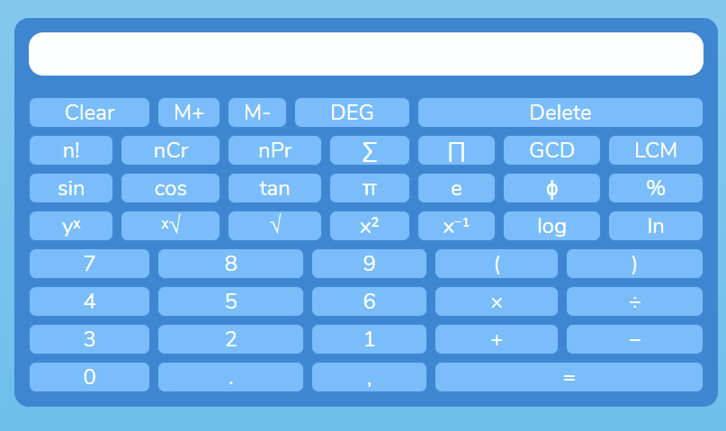

<center>
    
</center>

## General Info

This project is a scientific calculator that runs on the browser. It provides special functions that might allow more convenience to the user compare to other calculators. In addition, this project implements the "*Shunting Yard Algorithm*" to evaluate expression according to the order of operations (BEDMAS). 

<br>

## Technologies
Project is created with
* HTML5 / CSS / JavaScript
* BrowserifyJS version: 3.8.14
* Babelify version: 10.0.0
* Tinyify version: 3.0.0
* jQuery version: 3.5.1

<br>

## Setup
To run this project, ensure that node is installed on the system. This application is runned with "*Babel*" to allow live editing. To run this project, type the following commands in the terminal.

<br>

```
cd ../Scientific-Calculator
npm run start
npm run build
npm run watch
```
<br>

# Features
The following special commands with their commands our listed below (don't forget to type parentheses when using these function; include comma for second argument as well):

<br>

<hr>

Combinations (nCr): <hr>
* Formula: 

* Parameters: 

<hr>    

Permutations (nPr): <hr>
* Formula: 
* Parameters:  
<hr>

Sumation (sum(n, k) or sum(n) if k = 0): <hr>
* Formula: 
* Parameters: 

<hr>

Sum of Squares (sumGeo(n, k) or sumGeo(n) if k = 0)): <hr>
* Formula: 
* Parameters: 

<hr>

Greatest Common Denominator (GCD(n, k)) and Lowest Common Denominator (LCM(n, k)): <hr>
* Formula: Euclidean Algorithm
* Parameter: 

<hr>

Logarithm (log(n, k)): <hr>
* Formula: 
* Parameter: 

<br>

Other functionatlity includes toggling from degrees to radians when computing trig functions and saving (M+) or clearing (M-) the evaluated answer.